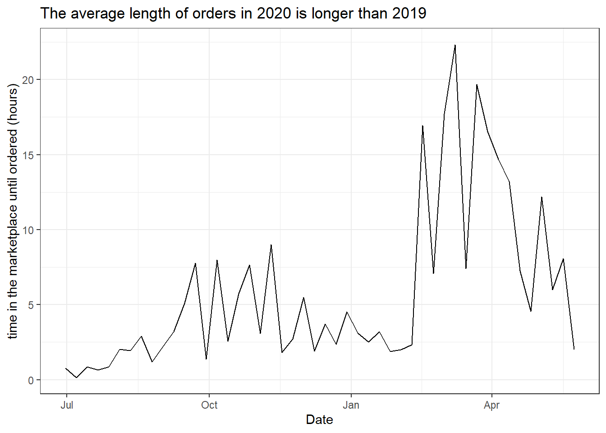
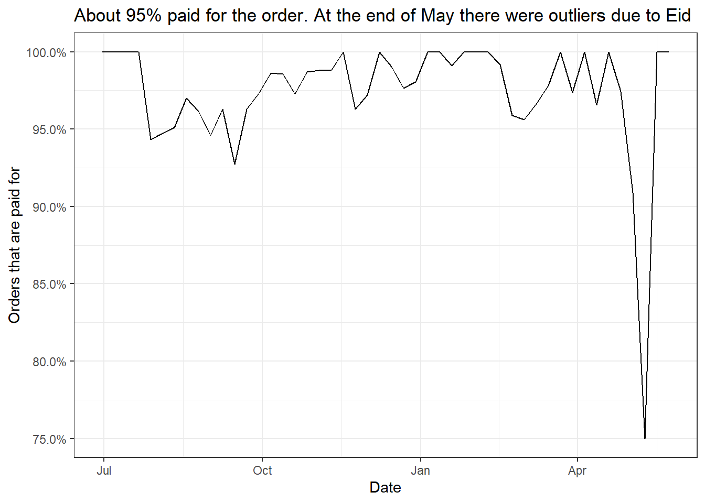
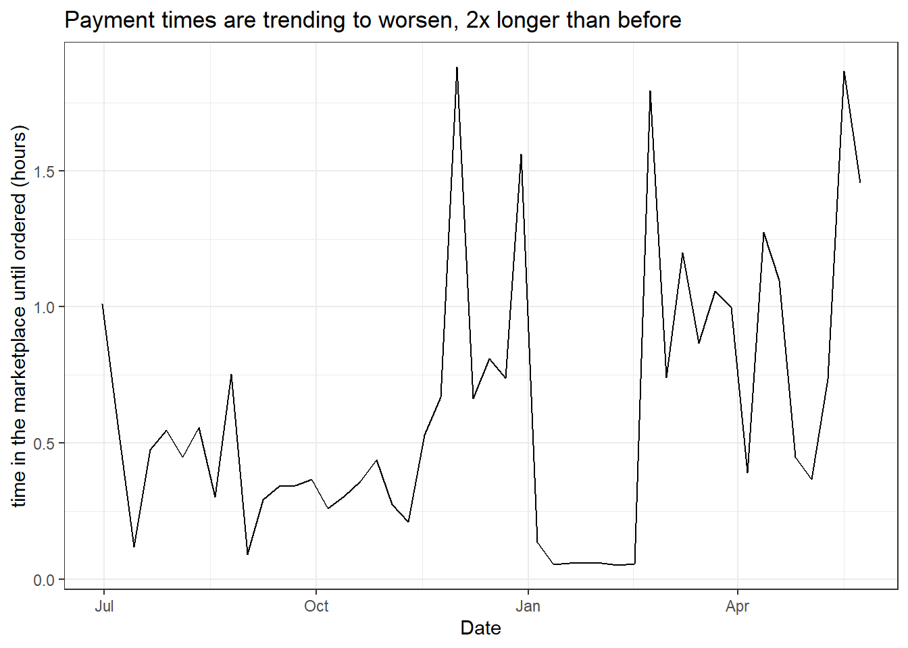
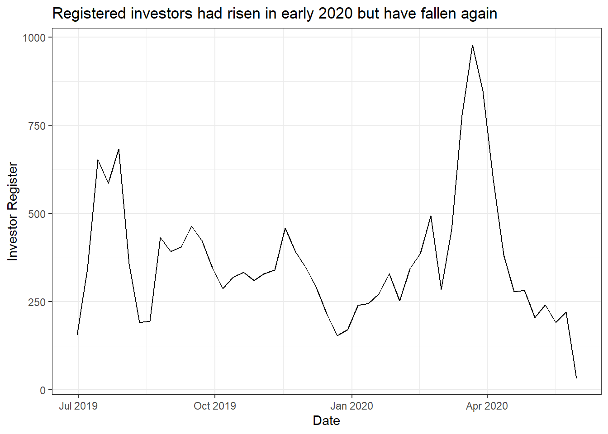
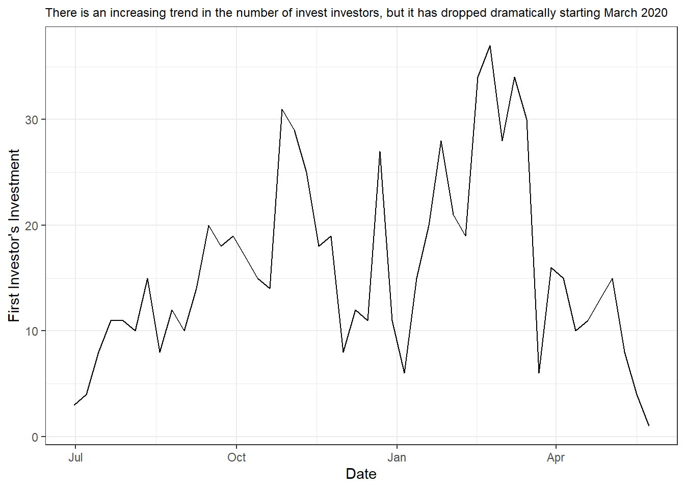

# Investor’s Investment Process Analysis

## Project Data Analysis For Finance : Investor's Investment Process

### Background

DQLab Finance is a peer to peer lending company, so DQLab Finance requires investors to provide loans to prospective borrowers.

Every time a borrower applies for a loan, DQLab Finance will upload the loan to the marketplace. Investors who have registered will see the loan, if there is a match, they will order and pay. So that the investor will finance the selected loan.

In this project, an analysis of the investment process of the investor will be carried out.

### Tasks and Steps

In this assignment, we will analyze how the behavior is

The steps that will be taken are,
1. Data exploration
2. Data manipulation
3. Analysis of the investment process
4. Analyze the time until the first investment
5. Invest retention analysis

### Package

In this analysis, several packages will be used that help us perform data analysis,

- `Package dplyr`, is a package that is most often used in data analysis, very helpful in data manipulation, the most commonly used functions are,

    - mutate() : create new variables based on existing variables
    - select() : choose a variable based on its name
    - filter() : filter data based on the value of the variable
    - summarise() : converts multiple values into one summary value
    - arrange() : sort rows of data

- `Package ggplot2`, is a package used for plotting with a consistent syntax, in general, for plotting by calling functions,

    `ggplot(data) + geom_type(aes(x,y,fill,color))`
    
    - geom_type replaced with functions according to the expected plot types, for example geom_line, geom_bar, geom_point, geom_boxplot and others.
    
- `Packages scales`, used to format numeric data values into a format that is easy to read, not used very often, but helps when exploring data, commonly used functions are,

    - comma() : changes numeric to thousands of symbols, for example r 10 ^ 10 is changed to r scales :: comma (10 ^ 10)
    - percent() : converts numeric to a percent format, for example r 0.65877 converts to r scales :: percent (0.65877)

- `Packages tidyr`, used to format data, from wide to long. very useful in the data preparation stage, commonly used functions are,

    - spread() : formats data.frame to be wide, the contents of the key column are changed to the column names, and the contents of the value columns are changed to the contents of each column of the row
    - gather() : format data.frame to be long, the name of the selected column name is used as the contents of the key column, while previously the contents of the columns become the contents of the value column

- `Packages lubridate`, used to process data types Date and Timestamp, commonly used functions are,

    - ymd() : Change the character type with YearMonthDate format to Date type
    - ymd_hms() : Change the character type with YearMonthDate HourMinuteSecond format to Timestamp type
    - floor_date() : rounds the Date / Timestamp down according to the type of time inputted

### This data will be made in a weekly plot to see how the trend is

